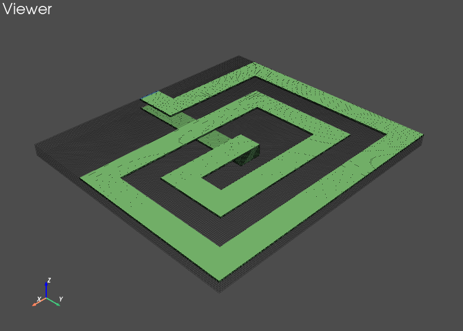
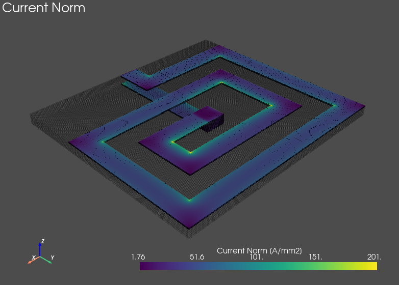

# PyPEEC - 3D FFT-PEEC Solver 

## Summary

**PyPEEC** is a **magnetic field solver** with the following characteristics:
* 3D voxel geometry
* FFT-PEEC method
* Extremely fast
* Conductive domain (no magnetic or dielectric media)
* Frequency domain solution
* Connection of current and voltage sources
* Computation of magnetic field and impedances
* Pure Python implementation

The **PyPEEC** contains the following tools:
* **mesher**: create a 3D voxel structure from STL or PNG files
* **viewer**: visualization of the 3D voxel structure
* **solver**: solver for the magnetic field problem
* **plotter**: visualization of the problem solution

All the modules and packages are located in the `PyPEEC` folder.
The module `PyPEEC.script` contains the entry point scripts.
Different command line scripts are defined: `ppmesher`, `ppviewer`, `ppsolver`, and `ppplotter`.

Different examples are located in the `examples` folder:
* **stl_inductor**: an inductor created from STL files
* **stl_transformer**: an transformer created from STL files
* **png_inductor**: an inductor created from PNG files
* **png_wire**: a straight created from PNG files
* **voxel_slab**: a simple slab conductor (with field computation)
* **voxel_transformer**: a simple transformer (with field computation)

## Gallery

## Compatibility

PyPEEC is using the following packages:
* Python 3
* Numpy and Scipy
* scikit-umfpack (for the solver, optional)
* pyFFTW (for the solver, optional)
* pyvista and imageio (for the mesher)
* matplotlib, pyvista, pyvistaqt, QtPy, PyQt5 (for the viewer and plotter)

PyPEEC is tested on Linux x64 but should run on other platforms.

## Packaging and Environment

* A Python package can be built from the (`pyproject.toml` and `setup.cfg`).
* In order to create a Python Virtual Environment, use `requirements.txt`.
* In order to create a Conda Environment, use `conda.yml`.
* The tests are located in the `tests` folder and can be run with `run_tests.sh`.

## Credits

The FFT-PEEC method has been first described and implemented in:
* R. Torchio, IEEE TPEL, 10.1109/TPEL.2021.3092431
* R. Torchio, https://github.com/UniPD-DII-ETCOMP/FFT-PEEC

Other interesting papers about similar methods:
* A. Yucel, IEEE TMTT, 10.1109/TMTT.2017.2785842
* P. Bettini, IOP, 10.1088/1361-6587/abce8f
* N. Marconato, ICECCME, 10.1109/ICECCME52200.2021.9590864

## Author

* **Thomas Guillod**, Dartmouth College
* [guillod@otvam.ch](mailto:guillod@otvam.ch)
* [https://otvam.ch](https://otvam.ch)

## Copyright

> (c) 2023 - Thomas Guillod - Dartmouth College

> **Warning**: Some dependencies are under copyleft licences.
> Make sure to respect these licenses when distributing the package.
