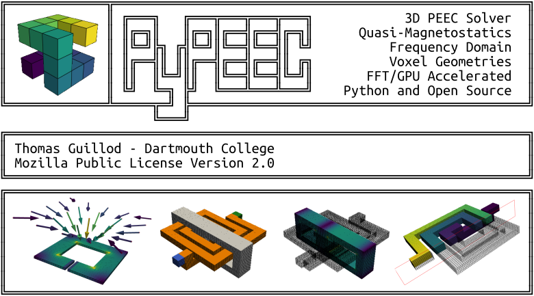

# PyPEEC - 3D PEEC Solver

> * **Website: [pypeec.otvam.ch](https://pypeec.otvam.ch)**
> * **Repository: [github.com/otvam/pypeec](https://github.com/otvam/pypeec)**

## Summary

**PyPEEC** is a **3D quasi-magnetostatic field solver** with the following characteristics:
* **PEEC method** with **FFT acceleration**
* Representation of the **geometry** with **3D voxels**
* **Multithreading and GPU acceleration** are available
* **Fast** with **moderate memory** requirements
* Import the **geometry** from **STL**, **PNG**, and **GERBER** files
* Draw the **geometry** with stacked 2D **vector shapes** or **voxel indices**
* **Pure Python** and **Open source** implementation
* Can be used from the **command line**
* Can be used with **Jupyter notebooks**
* Advanced **plotting** capabilities

**PyPEEC** solves the following **3D quasi-magnetostatic problems**:
* Frequency domain solution (DC and AC)
* Conductive and magnetic domains (ideal or lossy)
* Connection of current and voltage sources
* Extraction of the loss and energy densities
* Extraction of the current density, flux density, and potential
* Extraction of the terminal voltage, current, and power
* Computation of the free-space magnetic field 

**PyPEEC** has the following **limitations**:
* No capacitive effects
* No dielectric domains
* No advanced boundaries conditions
* No model order reduction techniques
* Limited to voxel geometries

The **PyPEEC** package contains the following tools:
* **mesher**: create a 3D voxel structure from STL or PNG files
* **viewer**: visualization of the 3D voxel structure
* **solver**: solver for the magnetic field problem
* **plotter**: visualization of the problem solution

## Project Links

* [Website](https://pypeec.otvam.ch)
* [Repository](https://github.com/otvam/pypeec)
* [Releases](https://github.com/otvam/pypeec/releases)
* [Tags](https://github.com/otvam/pypeec/tags)
* [Issues](https://github.com/otvam/pypeec/issues)
* [PyPi](https://pypi.org/project/pypeec)

## Credits

The FFT-accelerated PEEC method with voxels has been first described and implemented in:
* R. Torchio, IEEE TPEL, 10.1109/TPEL.2021.3092431, 2022
* R. Torchio, https://github.com/UniPD-DII-ETCOMP/FFT-PEEC

Other interesting papers and codes about similar methods:
* A. Yucel, IEEE TMTT, 10.1109/TMTT.2017.2785842, 2018
* P. Bettini, IOP, 10.1088/1361-6587/abce8f, 2020
* N. Marconato, ICECCME, 10.1109/ICECCME52200.2021.9590864, 2021
* A. Yucel, https://github.com/acyucel/VoxHenry

## Author

* **Thomas Guillod**, Dartmouth College, NH, USA
* Email: [guillod@otvam.ch](mailto:guillod@otvam.ch)
* Personal Website: [otvam.ch](https://otvam.ch)
* Dartmouth Engineering: [engineering.dartmouth.edu](https://engineering.dartmouth.edu)
* PMIC: [pmic.engineering.dartmouth.edu](https://pmic.engineering.dartmouth.edu)

## Copyright

> (c) 2023 - Thomas Guillod - Dartmouth College
> 
>  This Source Code Form is subject to the terms of the Mozilla Public
>  License, v. 2.0. If a copy of the MPL was not distributed with this
>  file, You can obtain one at http://mozilla.org/MPL/2.0/.
