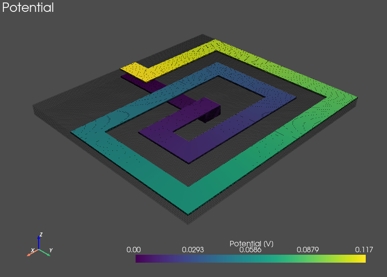
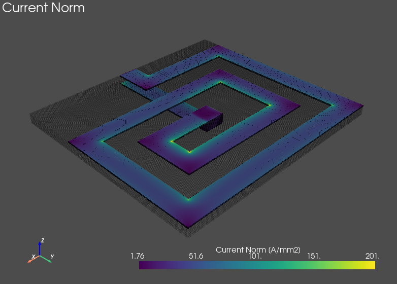

# PyPEEC - 3D FFT-PEEC Solver

## Summary

**PyPEEC** is a **magnetic field solver** with the following characteristics:
* 3D voxel geometry
* FFT-PEEC method
* Extremely fast
* Pure Python implementation
* Conductive domain (no magnetic or dielectric media)
* Frequency domain solution
* Connection of current and voltage sources
* Computation of magnetic field and impedances

The **PyPEEC** package contains the following tools:
* **mesher**: create a 3D voxel structure from STL or PNG files
* **viewer**: visualization of the 3D voxel structure
* **solver**: solver for the magnetic field problem
* **plotter**: visualization of the problem solution

## Documentation

* [**Getting Started**](docs/tutorial.md) - Explanation of the workflow of PyPEEC
* [**Technical Details**](docs/technical.md) - Explanation of the dependencies, packing, and tests

## Gallery

## Credits

The FFT-PEEC method has been first described and implemented in:
* R. Torchio, IEEE TPEL, 10.1109/TPEL.2021.3092431
* R. Torchio, https://github.com/UniPD-DII-ETCOMP/FFT-PEEC

Other interesting papers about similar methods:
* A. Yucel, IEEE TMTT, 10.1109/TMTT.2017.2785842
* P. Bettini, IOP, 10.1088/1361-6587/abce8f
* N. Marconato, ICECCME, 10.1109/ICECCME52200.2021.9590864

## Author

* **Thomas Guillod**, Dartmouth College
* [guillod@otvam.ch](mailto:guillod@otvam.ch)
* [https://otvam.ch](https://otvam.ch)

## Copyright

> (c) 2023 - Thomas Guillod - Dartmouth College

> **Warning**: Some dependencies are under copyleft licences.
> Make sure to respect these licenses when distributing the package.
