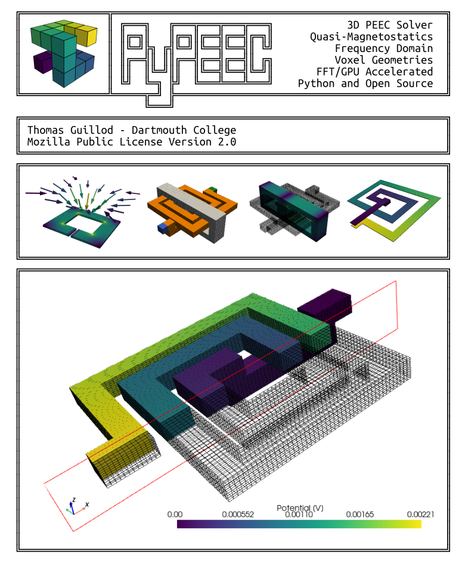

# PyPEEC - 3D PEEC Solver

## Summary

**PyPEEC** is a **3D magnetic field solver** with the following characteristics:
* **3D voxel** geometry
* **PEEC method** with **FFT acceleration**
* **GPU acceleration** is available
* Pure **Python** implementation
* **Fast** with **moderate memory** requirements
* Advanced **plotting** capabilities
* Can be used with **Jupyter** notebooks
* Conductive and magnetic domains
* Frequency domain solution
* Connection of current and voltage sources
* Extraction of the current density and potential
* Extraction of the losses and energy
* Extraction of the terminal impedances
* Computation of the magnetic field 

**PyPEEC** has the following limitations:
* No capacitive effects
* No dielectric domains
* No advanced boundaries conditions
* Limited to voxel geometries

The **PyPEEC** package contains the following tools:
* **mesher**: create a 3D voxel structure from STL or PNG files
* **viewer**: visualization of the 3D voxel structure
* **solver**: solver for the magnetic field problem
* **plotter**: visualization of the problem solution

## Documentation

* [**Gallery**](docs/gallery.md) - Gallery of screenshots
* [**Getting Started**](docs/tutorial.md) - Explanation of the workflow of PyPEEC
* [**Technical Details**](docs/technical.md) - Technical explanations about PyPEEC
* [**File Formats**](docs/format.md) - Definition of the different file formats

## Screenshot

## Credits

The FFT-accelerated PEEC method with voxels has been first described and implemented in:
* R. Torchio, IEEE TPEL, 10.1109/TPEL.2021.3092431, 2022
* R. Torchio, https://github.com/UniPD-DII-ETCOMP/FFT-PEEC

Other interesting papers and codes about similar methods:
* A. Yucel, IEEE TMTT, 10.1109/TMTT.2017.2785842, 2018
* P. Bettini, IOP, 10.1088/1361-6587/abce8f, 2020
* N. Marconato, ICECCME, 10.1109/ICECCME52200.2021.9590864, 2021
* A. Yucel, https://github.com/acyucel/VoxHenry

## Project Repository

* [Repository](https://github.com/otvam/PyPEEC)
* [Releases](https://github.com/otvam/PyPEEC/tags)
* [Issues](https://github.com/otvam/PyPEEC/issues)

## Author

* **Thomas Guillod**, Dartmouth College, NH, USA
* Email: [guillod@otvam.ch](mailto:guillod@otvam.ch)
* Personal website: [https://otvam.ch](https://otvam.ch)
* Lab website: [https://pmic.engineering.dartmouth.edu](https://pmic.engineering.dartmouth.edu)

## Copyright

> (c) 2023 - Thomas Guillod - Dartmouth College
> 
> All rights reserved.
> 
> THE SOFTWARE IS PROVIDED "AS IS", WITHOUT WARRANTY OF ANY KIND, EXPRESS OR
> IMPLIED, INCLUDING BUT NOT LIMITED TO THE WARRANTIES OF MERCHANTABILITY,
> FITNESS FOR A PARTICULAR PURPOSE AND NONINFRINGEMENT. IN NO EVENT SHALL THE
> AUTHORS OR COPYRIGHT HOLDERS BE LIABLE FOR ANY CLAIM, DAMAGES OR OTHER
> LIABILITY, WHETHER IN AN ACTION OF CONTRACT, TORT OR OTHERWISE, ARISING FROM,
> OUT OF OR IN CONNECTION WITH THE SOFTWARE OR THE USE OR OTHER DEALINGS IN THE
> SOFTWARE.
