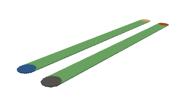

Examples
========

Running the Examples
--------------------

* Extract the examples with the ``pypeec examples`` command.

* For running the examples from **Python**:

  * ``examples_config.py`` is used to select the example
  * ``run_mesher.py`` runs the mesher
  * ``run_viewer.py`` runs the viewer
  * ``run_solver.py`` runs the solver
  * ``run_plotter.py`` runs the plotter

* For running the examples from the **Shell**:

  * ``examples_config.sh`` is used to select the example
  * ``run_mesher.sh`` runs the mesher
  * ``run_viewer.sh`` runs the viewer
  * ``run_solver.sh`` runs the solver
  * ``run_plotter.sh`` runs the plotter

* For running the examples from a **Jupyter notebook**, use ``notebook.ipynb``:

  * Jupyter should be installed (not included in the default environment).
  * IPyWidgets and Trame are used for the rendering inside Jupyter notebooks.

STL Mesher Examples
-------------------

examples_stl/inductor_air
^^^^^^^^^^^^^^^^^^^^^^^^^

* **3D air-core inductor**
* Defined with **STL files**

.. image:: ../examples/examples_stl_inductor_air.png

examples_stl/inductor_core
^^^^^^^^^^^^^^^^^^^^^^^^^^

* **3D inductor with a magnetic E-core**
* Defined with **STL files**

.. image:: ../examples/examples_stl_inductor_core.png

examples_stl/inductor_toroid
^^^^^^^^^^^^^^^^^^^^^^^^^^^^

* **3D inductor with a toroidal core**
* Defined with **STL files**

examples_stl/transformer
^^^^^^^^^^^^^^^^^^^^^^^^

* **Planar transformer with two windings**
* Defined with **STL files**

.. image:: ../examples/examples_stl_transformer.png

Shape Mesher Examples
---------------------

examples_shape/busbar
^^^^^^^^^^^^^^^^^^^^^

* **Coplanar L-shaped busbar**
* Defined with **2D shapes**

.. image:: ../examples/examples_shape_busbar.png

examples_shape/coplanar
^^^^^^^^^^^^^^^^^^^^^^^

* **PCB with coplanar traces**
* Defined with **2D shapes**

examples_shape/parallel
^^^^^^^^^^^^^^^^^^^^^^^

* **Parallel wires with opposing currents**
* Defined with **2D shapes**

.. image:: ../examples/examples_shape_parallel.png

examples_shape/hole
^^^^^^^^^^^^^^^^^^^

* **Trace with a hole**
* Defined with **2D shapes**

.. image:: ../examples/examples_shape_hole.png

examples_shape/wire
^^^^^^^^^^^^^^^^^^^

* **Straight round wire**
* Defined with **2D shapes**

.. image:: ../examples/examples_shape_wire.png

PNG Mesher Examples
-------------------

examples_png/inductor_spiral
^^^^^^^^^^^^^^^^^^^^^^^^^^^^

* **Planar spiral inductor**
* Defined with **PNG files**

.. image:: ../examples/examples_png_inductor_spiral.png

examples_png/inductor_gap
^^^^^^^^^^^^^^^^^^^^^^^^^

* **Gapped inductor with a magnetic E-core**
* Defined with **PNG files**

.. image:: ../examples/examples_png_inductor_gap.png

examples_png/inductor_pot
^^^^^^^^^^^^^^^^^^^^^^^^^

* **Pot-core inductor with external gap**
* Defined with **PNG files**

examples_png/iron_core
^^^^^^^^^^^^^^^^^^^^^^^^^

* **Iron magnetic core with relative permeability and finite resistivity**
* Defined with **PNG files**

examples_png/shield
^^^^^^^^^^^^^^^^^^^

* **Conductor loop with a magnetic shield**
* Defined with **PNG files**

.. image:: ../examples/examples_png_shield.png

examples_png/gerber
^^^^^^^^^^^^^^^^^^^

* **PCB inductor defined with GERBER files**
* The **PNG files** are generated from **GERBER files**

.. image:: ../examples/examples_png_gerber.png

Voxel Mesher Examples
---------------------

examples_voxel/slab
^^^^^^^^^^^^^^^^^^^

* **Simple slab conductor in free space**
* Defined with **voxel indices**

.. image:: ../examples/examples_voxel_slab.png

examples_voxel/core
^^^^^^^^^^^^^^^^^^^

* **Simple slab conductor surrounded by a magnetic core**
* Defined with **voxel indices**

.. image:: ../examples/examples_voxel_core.png

examples_voxel/transformer
^^^^^^^^^^^^^^^^^^^^^^^^^^

* **Simple transformer with a short-circuited winding**
* Defined with **voxel indices**

.. image:: ../examples/examples_voxel_transformer.png

examples_voxel/anisotropic
^^^^^^^^^^^^^^^^^^^^^^^^^^

* **L-shaped conductor with anisotropic resistivity**
* Defined with **voxel indices**

.. image:: ../examples/examples_voxel_anisotropic.png

examples_voxel/distributed
^^^^^^^^^^^^^^^^^^^^^^^^^^

* **Slab conductor with space dependent resistivity**
* Defined with **voxel indices**

.. image:: ../examples/examples_voxel_distributed.png

examples_voxel/logo
^^^^^^^^^^^^^^^^^^^

* **Simple geometry used for the PyPEEC logo**
* Defined with **voxel indices**

.. image:: ../examples/examples_voxel_logo.png
