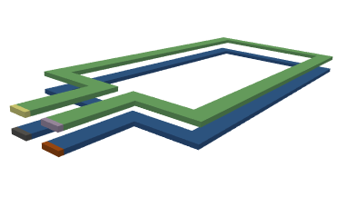

Examples
========

Running the Examples
--------------------

* Extract the examples with the ``pypeec examples`` command.

* For running the examples from **Python**:

  * ``examples_config.py`` is used to select the example
  * ``run_mesher.py`` runs the mesher
  * ``run_viewer.py`` runs the viewer
  * ``run_solver.py`` runs the solver
  * ``run_plotter.py`` runs the plotter

* For running the examples from the **Shell**:

  * ``examples_config.sh`` is used to select the example
  * ``run_mesher.sh`` runs the mesher
  * ``run_viewer.sh`` runs the viewer
  * ``run_solver.sh`` runs the solver
  * ``run_plotter.sh`` runs the plotter

* For running the examples from a **Jupyter notebook**, use ``notebook.ipynb``:

  * JupyterLab should be installed (not included in the default environment).
  * IPyWidgets, Trame, and ipympl are used for the rendering inside Jupyter notebooks.

STL Mesher Examples
-------------------

examples_stl/inductor_air
^^^^^^^^^^^^^^^^^^^^^^^^^

* Defined with **STL files**
* **3D air-core spiral inductor**

examples_stl/inductor_core
^^^^^^^^^^^^^^^^^^^^^^^^^^

* Defined with **STL files**
* **3D inductor with a magnetic E-core**

examples_stl/inductor_toroid
^^^^^^^^^^^^^^^^^^^^^^^^^^^^

* Defined with **STL files**
* **3D inductor with a toroidal core**

.. image:: ../examples/examples_stl/inductor_toroid.png

examples_stl/transformer_core
^^^^^^^^^^^^^^^^^^^^^^^^^^^^^

* Defined with **STL files**
* **Transformer with two windings and a magnetic core**

.. image:: ../examples/examples_stl/transformer_core.png

examples_stl/transformer_air
^^^^^^^^^^^^^^^^^^^^^^^^^^^^

* Defined with **STL files**
* **Planar air-core transformer with two windings**
* Extraction of the **impedance matrix** from the solution
* Example for the extraction of the impedance matrix: ``run_matrix.py``

Shape Mesher Examples
---------------------

examples_shape/busbar
^^^^^^^^^^^^^^^^^^^^^

* Defined with **2D shapes**
* **Coplanar L-shaped busbar**

examples_shape/coplanar
^^^^^^^^^^^^^^^^^^^^^^^

* Defined with **2D shapes**
* **PCB with coplanar traces**

.. image:: ../examples/examples_shape/coplanar.png

examples_shape/parallel
^^^^^^^^^^^^^^^^^^^^^^^

* Defined with **2D shapes**
* **Parallel wires with opposing currents**

examples_shape/hole
^^^^^^^^^^^^^^^^^^^

* Defined with **2D shapes**
* **Single PCB trace with a hole**

.. image:: ../examples/examples_shape/hole.png

examples_shape/wire
^^^^^^^^^^^^^^^^^^^

* Defined with **2D shapes**
* **Single straight round wire**

.. image:: ../examples/examples_shape/wire.png

examples_shape/pwm
^^^^^^^^^^^^^^^^^^

* Defined with **2D shapes**
* **Planar spiral inductor**
* **Non-sinusoidal** analysis with **Fourier** series
* Example for the frequency domain analysis: ``run_fourier.py``

PNG Mesher Examples
-------------------

examples_png/inductor_spiral
^^^^^^^^^^^^^^^^^^^^^^^^^^^^

* Defined with **PNG files**
* **Planar spiral inductor**

.. image:: ../examples/examples_png/inductor_spiral.png

examples_png/inductor_gap
^^^^^^^^^^^^^^^^^^^^^^^^^

* Defined with **PNG files**
* **Gapped inductor with a magnetic E-core**

.. image:: ../examples/examples_png/inductor_gap.png

examples_png/inductor_pot
^^^^^^^^^^^^^^^^^^^^^^^^^

* Defined with **PNG files**
* **Pot-core inductor with external gap**

.. image:: ../examples/examples_png/inductor_pot.png

examples_png/iron_core
^^^^^^^^^^^^^^^^^^^^^^^^^

* Defined with **PNG files**
* **Iron magnetic core with a non-zero resistivity**

.. image:: ../examples/examples_png/iron_core.png

examples_png/shield
^^^^^^^^^^^^^^^^^^^

* Defined with **PNG files**
* **Conductor loop with a magnetic shield**

.. image:: ../examples/examples_png/shield.png

examples_png/gerber
^^^^^^^^^^^^^^^^^^^

* Defined with **PNG files**
* **PCB inductor defined with GERBER files**
* Generation of the PNG files from **GERBER files**
* Example for parsing the GERBER files: ``run_gerber.py``

Voxel Mesher Examples
---------------------

examples_voxel/slab
^^^^^^^^^^^^^^^^^^^

* Defined with **voxel indices**
* **Simple slab conductor in free space**

.. image:: ../examples/examples_voxel/slab.png

examples_voxel/transformer
^^^^^^^^^^^^^^^^^^^^^^^^^^

* Defined with **voxel indices**
* **Simple transformer with a short-circuited winding**

examples_voxel/anisotropic
^^^^^^^^^^^^^^^^^^^^^^^^^^

* Defined with **voxel indices**
* **L-shaped conductor with anisotropic resistivity**

.. image:: ../examples/examples_voxel/anisotropic.png

examples_voxel/distributed
^^^^^^^^^^^^^^^^^^^^^^^^^^

* Defined with **voxel indices**
* **Slab conductor with space dependent resistivity**

examples_voxel/logo
^^^^^^^^^^^^^^^^^^^

* Defined with **voxel indices**
* **Simple geometry used for the PyPEEC logo**

.. image:: ../examples/examples_voxel/logo.png

examples_voxel/core
^^^^^^^^^^^^^^^^^^^

* Defined with **voxel indices**
* **Simple slab conductor surrounded by a magnetic core**
* **Procedural generation** of the voxel indices (1D and 3D)
* Example for generating the voxel indices: ``run_voxel.py``

.. image:: ../examples/examples_voxel/core.png
