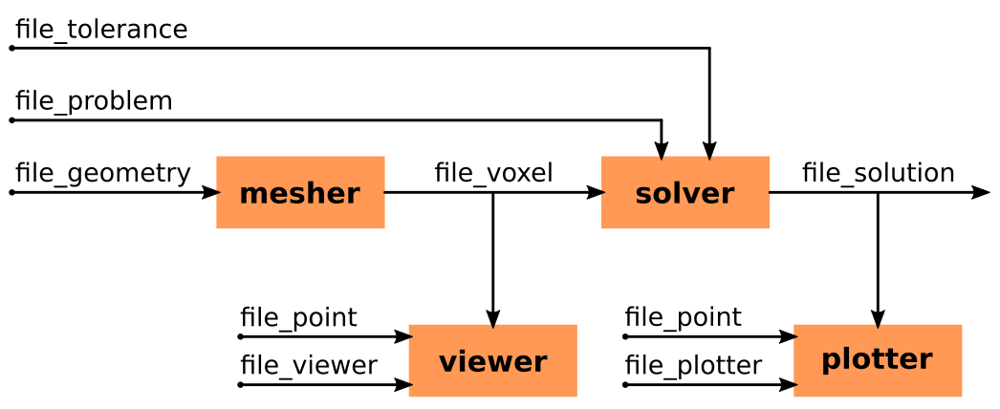

File Formats
============

PyPEEC Workflow
---------------

   Description of the PyPEEC workflow (mesher, viewer, solver, and plotter).
   The input files (geometry, problem, tolerance, plotter, and viewer) are either in JSON or YAML formats.
   The output files (voxel and solution) are either in JSON or MessagePack or Pickle formats.

Geometry File Format
--------------------

* The ``file_geometry`` file format is used by the mesher.
* This file contains the definition of the voxel structure.

.. literalinclude:: ../format/file_geometry.yaml
   :language: yaml

Definition from Index Arrays
^^^^^^^^^^^^^^^^^^^^^^^^^^^^

.. literalinclude:: ../format/file_geometry_voxel.yaml
   :language: yaml

Definition from 2D Vector Shapes
^^^^^^^^^^^^^^^^^^^^^^^^^^^^^^^^

.. literalinclude:: ../format/file_geometry_shape.yaml
   :language: yaml

Definition from PNG Files
^^^^^^^^^^^^^^^^^^^^^^^^^

.. literalinclude:: ../format/file_geometry_png.yaml
   :language: yaml

Definition from STL Files
^^^^^^^^^^^^^^^^^^^^^^^^^

.. literalinclude:: ../format/file_geometry_stl.yaml
   :language: yaml

Problem File Format
-------------------

* The ``file_problem`` file format is used by the solver.
* This file contains the definition of the magnetic problem to be solved.

.. literalinclude:: ../format/file_problem.yaml
   :language: yaml

Other File Formats
------------------

* The ``file_tolerance`` format is documented in ``examples/config/tolerance.yaml``.
* The ``file_viewer`` format is documented in ``examples/config/viewer.yaml``.
* The ``file_plotter`` format is documented in ``examples/config/plotter.yaml``.
