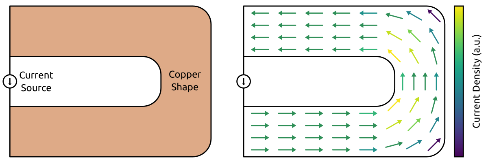
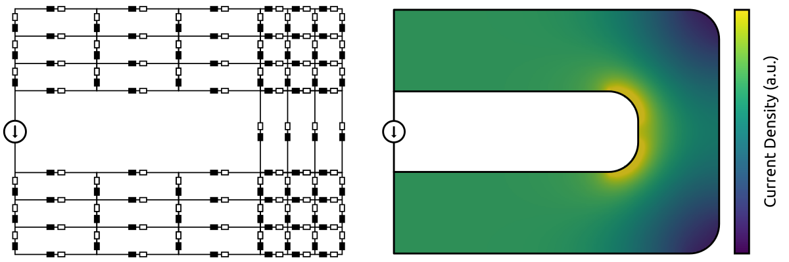
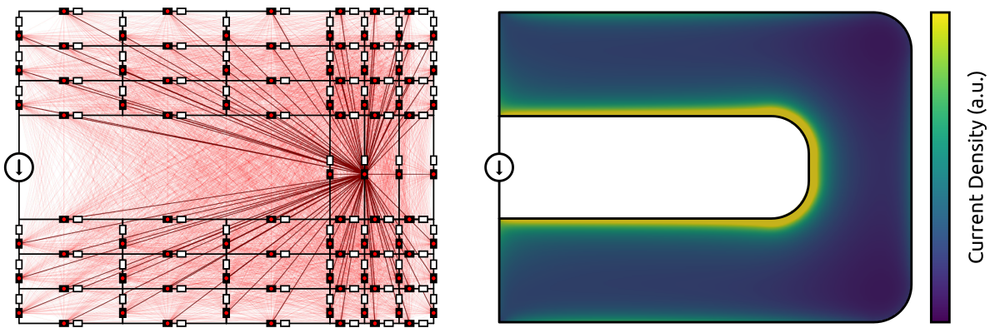
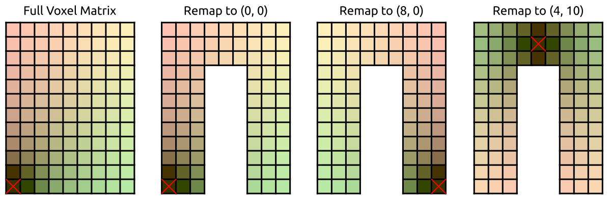

PEEC Method
===========

PEEC Introduction
-----------------

The PEEC method is an integral equation method proposed in 1974 (`paper <https://doi.org/10.1109/TMTT.1974.1128204>`__).
The fundamental idea is to represent the field simulation problem with a very large distributed equivalent circuit.
In order to explain the PEEC method step-by-step, a U-shaped busbar (:ref:`Fig. 1 <fig_1>`) is considered.
For this geometry, an inhomogeneous current distribution is expected (current crowding in the corners).

.. _fig_1:

   Fig. 1 - Example problem: U-shaped busbar with a current source.

PEEC for Static Problems
------------------------

In order to get the static solution (DC solution) of the problem, a discretization of the geometry is required.
The geometry is divided into simple cells and the resistance of each cell can be analytically calculated.
Then, the PEEC problem can be formulated with a distributed equivalent circuit (:ref:`Fig. 2 <fig_2>`).
Finally, the circuit is solved and the current and voltage distribution is obtained.

.. _fig_2:

   Fig. 2 - PEEC equivalent circuit and solution for the static problem.

PEEC for Quasi-Static Problems
------------------------------

For the quasi-static solution (AC solution), the system cannot be represented with a purely resistive circuit.
A natural step would be to extend the resistive circuit with self inductances (:ref:`Fig. 3 <fig_3>`).
However, the obtained current distribution is identical to the DC solution, which is incorrect.

.. _fig_3:

   Fig. 3 - Extension of the PEEC circuit with self inductances (incorrect solution).

The reason behind this incorrect solution is linked to the Faraday's law of induction.
The magnetic field produced by the current of a cell is inducing a voltage in the neighboring cells.
Therefore, self inductances are not sufficient, mutual inductances between the cells are also required.
The updated equivalent circuit (:ref:`Fig. 4 <fig_4>`) depicts the resistances, self inductances, and mutual inductances.
The obtained current distribution differs from the DC solution, which can be explained by the induced currents (eddy currents).
It can be seen that the current distribution is concentrated towards the edges of the busbar (skin and proximity effects).

.. _fig_4:

   Fig. 4 - PEEC equivalent circuit and solution for the quasi-static problem.

With this simple example, the main advantanges of the PEEC method are apparent:

* Only the active materials are discretized (no need to mesh the free-space).
* Intuitive understanding of the equation discretization process.
* Straightforward connection of external circuit elements.

However, the PEEC method also features some drawbacks:

* The number of mutual inductances increases quadratically with the number of cells.
* The matrix describing the equation system is not sparse (due to the dense inductance matrix).
* The computational cost is becoming problematic for large systems.
* The memory requirement is becoming problematic for large systems.

FFT-Accelerated PEEC Method
---------------------------

Several methods can be used to mitigate the dense matrix problem (domain decomposition, hierarchical matrix, multipole method, etc.).
PyPEEC is using the FFT-accelerated method proposed in 2022 (`paper <https://doi.org/10.1109/TPEL.2021.3092431>`__).
This variant of the PEEC method relies on the translational invariance of the mutual inductance coefficients.
In other word, the mutual inductance between two cells is only dependent on their relative positions to each other.
Therefore, if a regular voxel structure is used for the discretization, many coefficients are identical (:ref:`Fig. 5 <fig_5>`).

.. _fig_5:

   Fig. 5 - Illustration of the translational invariance of the inductance matrix coefficients.

The identical coefficients can be used to reduce the computational cost of the PEEC problem (:ref:`Fig. 6 <fig_6>`).
First, all the mutual inductances are computed with respect to a reference voxel (located at the corner of the structure).
Then, for any location, all the mutual inductances are obtained with a remapping of the coefficients computed for the reference voxel.
This implies that, for the inductance matrix, the number of independent coefficients is reduced from O(n^2) to O(n).
Hence, the computational cost and memory requirement for generating and storing the inductance matrix is massively reduced.

.. _fig_6:

   Fig. 6 - Illustration of the remapping of the inductance matrix coefficients.

With all the repeated coefficients, the inductance matrix is a a block-Toeplitz Toeplitz-block matrix.
For such matrices, the matrix-vector multiplications can be done with Fast Fourier Transforms (:ref:`Fig. 7 <fig_7>`).
Hence, the Fast Fourier Transforms are reducing the computational complexity of multiplications from O(n^2) to O(n*log(n)).

.. _fig_7:
.. figure:: ../method/peec_7.png

   Fig. 7 - Toeplitz matrix-vector multiplication with FFT.

In summary, with a voxel structure, the PEEC method features the following advantages:

* Reduction of the number of independent inductance coefficients from O(n^2) to O(n).
* Reduction of the memory footprint of the inductance matrix from O(n^2) to O(n).
* Reduction of the matrix multiplication complexity from O(n^2) to O(n*log(n)).
* PEEC problems with several millions of voxels can be solved in a few minutes.

Numerical Optimization
----------------------

The code is reasonably optimized, leveraging NumPy and SciPy for the heavy operations.
All the code is vectorized, no loops are used for the array/matrix/tensor operations.
Sparse matrix algebra is used wherever appropriate to speed up the code and limit the memory consumption.
Wherever possible, multithreading/multiprocessing is used for exploiting multicore CPUs.

The following optimizations are available for the computationally heavy operations:

* Computation of the Green functions and electric-magnetic coupling functions.

  * If the distance between the considered voxels is small, an analytical solution is used.
  * If the distance between the considered voxels is large, a numerical approximation is used.

* Two different approaches can be used to solve the equation system.

  * direct - The electric and magnetic equations are solved together.
  * segregated - The electric and magnetic equations are solved separately.

* Different sparse factorization algorithms are available for the sparse preconditioner.

  * SuperLU is typically slower but is always available (integrated with SciPy).
  * MKL/PARDISO is typically faster than SuperLU (available through Pydiso).
  * PyAMG is typically slow but uses less memory (risk of convergence issues).

* Different iterative solvers are available for the dense matrices.

  * GMRES - Generalized Minimal RESidual algorithm.
  * GCROT - Flexible GCROT(m,k) algorithm (often faster).

* The FFTs for computing matrix-vector product can be done with several algorithms.

  * NumPy FFT library is always available (integrated with NumPy).
  * SciPy FFT library is always available (integrated with SciPy).
  * FFTW has to be installed separately (available through pyFFTW).
  * MKL/FFT has to be installed separately (available through mkl_fft).
  * CuPy is extremely fast but require GPUs compatible with the CUDA toolkit.

* The ``file_tolerance`` input file is used to define all the numerical parameters:

  * Definition of the numerical options and tolerances.
  * Selection of the libraries used for numerical operations.
  * Definition of the multithreading/multiprocessing options.
