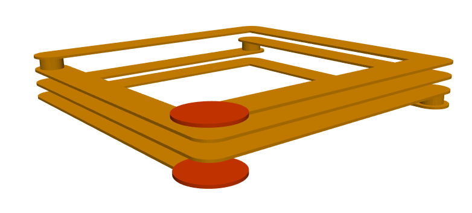
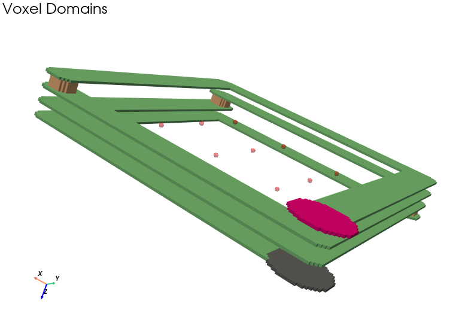
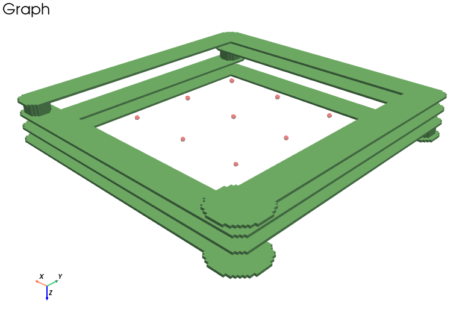
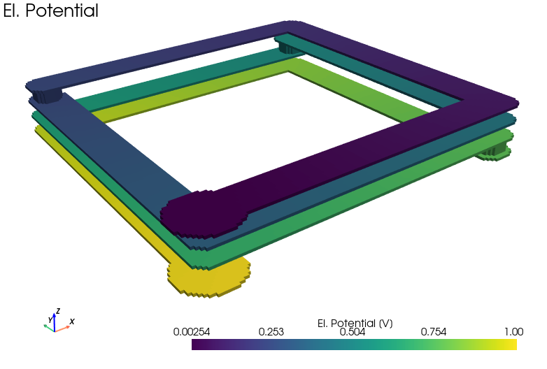
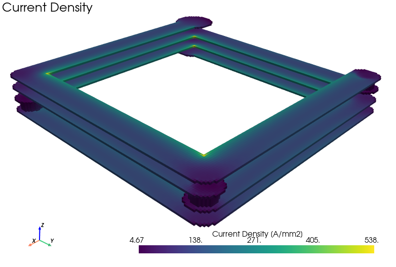
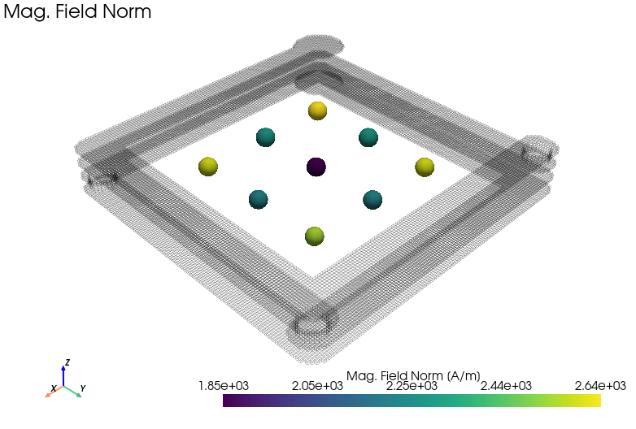
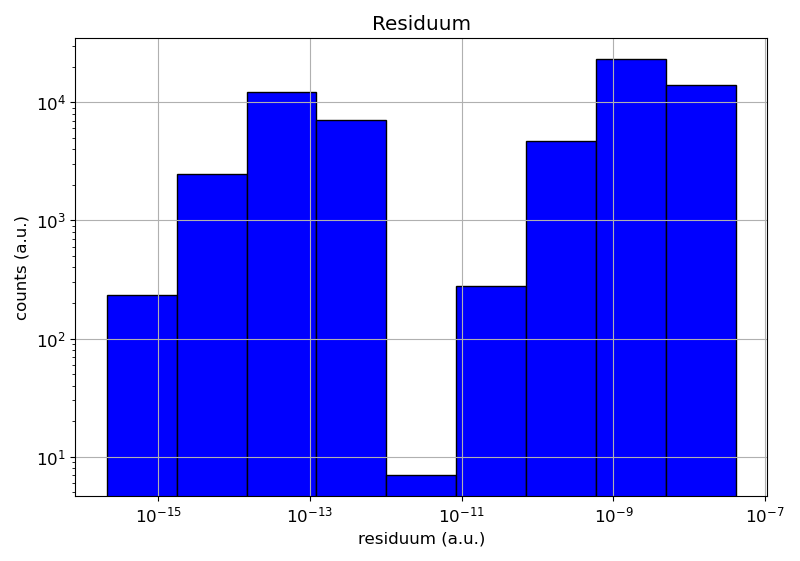

Tutorial
========

Step 1: Setup
-------------

.. code-block:: bash

    # Install PyPEEC
    #   - With a Python Environment
    #   - With a Conda Environment

    # Check the PyPEEC version
    pypeec --version

    # Extract the PyPEEC examples
    pypeec examples examples

    # Extract the PyPEEC documentation
    pypeec documentation documentation

Step 2: Introduction
--------------------

This tutorial demonstrates how PyPEEC can be used to simulate a four-layer PCB coil.
The coil has two terminals and the simulation is done in the frequency domain.
All the command are executed inside the virtual environment from the ``examples`` folder.

   Geometry of the considered four-layer PCB coil.

Step 3: Mesher
--------------

.. code-block:: bash

    # Run the mesher from the command line
    #   - geometry.yaml - contains the geometry description (input)
    #   - voxel.json.gz - contains the meshed voxel structure (output)

    pypeec mesher \
        --geometry tutorial/geometry.yaml \
        --voxel tutorial/voxel.json.gz

.. code-block:: python

    # Run the mesher from the Python interpreter
    #   - geometry.yaml - contains the geometry description (input)
    #   - voxel.json.gz - contains the meshed voxel structure (output)

    import pypeec

    file_geometry = "tutorial/geometry.yaml"
    file_voxel = "tutorial/voxel.json.gz"

    pypeec.run_mesher_file(
        file_geometry=file_geometry,
        file_voxel=file_voxel,
    )

.. literalinclude:: ../tutorial/log_mesher.txt
   :language: text

Step 4: Viewer
--------------

.. code-block:: bash

    # Run the viewer from the command line
    #   - voxel.json.gz - contains the meshed voxel structure (input)
    #   - viewer.yaml - contains the plot configuration (input)
    #   - tag_plot - list of plots to be shown (defined in viewer.yaml)
    #   - plot_mode - method used for rendering the plots

    pypeec viewer \
        --voxel tutorial/voxel.json.gz \
        --viewer config/viewer.yaml \
        --tag_plot domain graph \
        --plot_mode qt

.. code-block:: python

    # Run the viewer from the Python interpreter
    #   - voxel.json.gz - contains the meshed voxel structure (input)
    #   - viewer.yaml - contains the plot configuration (input)
    #   - tag_plot - list of plots to be shown (defined in viewer.yaml)
    #   - plot_mode - method used for rendering the plots

    import pypeec

    file_voxel = "tutorial/voxel.json.gz"
    file_viewer = "config/viewer.yaml"

    pypeec.run_viewer_file(
        file_voxel=file_voxel,
        file_viewer=file_viewer,
        tag_plot=["domain", "graph"],
        plot_mode="qt",
    )

   Plot showing which the different domains.

   Plot showing which domains are interconnected.

Step 5: Solver
--------------

.. code-block:: bash

    # Run the solver from the command line
    #   - voxel.json.gz - contains the meshed voxel structure (input)
    #   - problem.yaml - contains the magnetic problem description (input)
    #   - tolerance.yaml - contains the solver numerical tolerances (input)
    #   - solution.json.gz - contains the problem solution (output)

    pypeec solver \
        --voxel tutorial/voxel.json.gz \
        --problem tutorial/problem.yaml \
        --tolerance config/tolerance.yaml \
        --solution tutorial/solution.json.gz

.. code-block:: python

    # Run the solver from the Python interpreter
    #   - voxel.json.gz - contains the meshed voxel structure (input)
    #   - problem.yaml - contains the magnetic problem description (input)
    #   - tolerance.yaml - contains the solver numerical tolerances (input)
    #   - solution.json.gz - contains the problem solution (output)

    import pypeec

    file_voxel = "tutorial/voxel.json.gz"
    file_solution = "tutorial/solution.json.gz"
    file_problem = "tutorial/problem.yaml"
    file_tolerance = "config/tolerance.yaml"

    pypeec.run_solver_file(
        file_voxel=file_voxel,
        file_problem=file_problem,
        file_tolerance=file_tolerance,
        file_solution=file_solution,
    )

.. literalinclude:: ../tutorial/log_solver.txt
   :language: text

Step 6: Plotter
---------------

.. code-block:: bash

    # Run the plotter from the command line
    #   - solution.json.gz - contains the problem solution (input)
    #   - plotter.yaml - contains the plot configuration (input)
    #   - tag_plot - list of plots to be shown (defined in plotter.yaml)
    #   - plot_mode - method used for rendering the plots

    pypeec plotter \
        --solution tutorial/solution.json.gz \
        --plotter config/plotter.yaml \
        --tag_plot V_c_norm J_c_norm H_p_norm residuum \
        --plot_mode qt

.. code-block:: python

    # Run the plotter from the Python interpreter
    #   - solution.json.gz - contains the problem solution (input)
    #   - plotter.yaml - contains the plot configuration (input)
    #   - tag_plot - list of plots to be shown (defined in plotter.yaml)
    #   - plot_mode - method used for rendering the plots

    import pypeec

    file_solution = "tutorial/solution.json.gz"
    file_plotter = "config/plotter.yaml"

    pypeec.run_plotter_file(
        file_solution=file_solution,
        file_plotter=file_plotter,
        tag_plot=["V_c_norm", "J_c_norm", "H_p_norm", "residuum"],
        plot_mode="qt",
    )

   Plot showing the electric potential.

   Plot showing the current density.

   Plot showing the generated magnetic field.

   Plot showing the equation system residuum.
