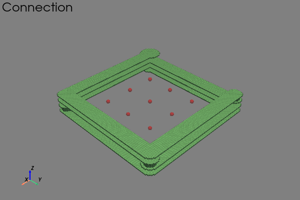
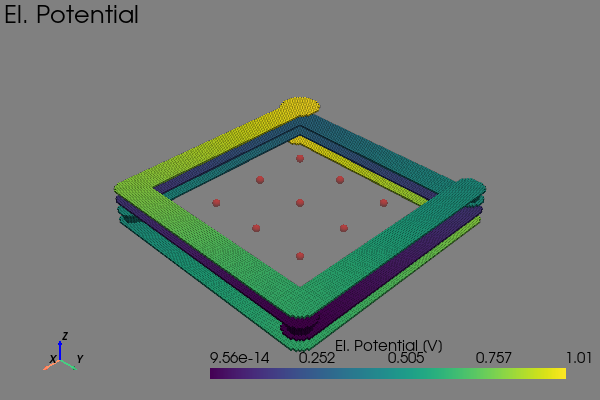
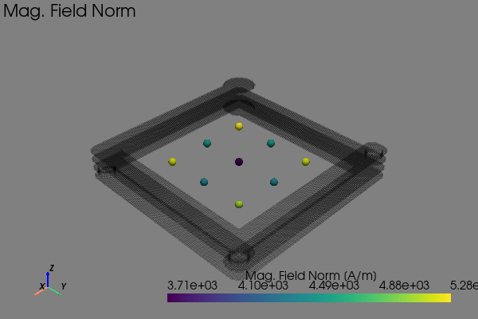

Tutorial
========

Installing the Code
-------------------

.. code-block:: bash

    # Installation of PyPEEC with pip
    #    - The Python executable can be "python" or "python3"
    #    - Alternatively, Conda can be used for the environment

    # Create a Python Virtual Environment
    python -m venv venv

    # Activate the Python Virtual Environment
    source venv/bin/activate

    # Install PyPEEC from PyPi
    python -m pip install pypeec

Extracting the Data
-------------------

.. code-block:: bash

    # Check the PyPEEC version
    pypeec --version

    # Extract the PyPEEC examples
    pypeec examples examples

    # Extract the PyPEEC documentation
    pypeec documentation documentation

Solving a Problem
-----------------

This tutorial demonstrates how PyPEEC can be used to simulate a four-layer PCB coil.
The coil has two terminals and the simulation is done in the frequency domain.
All the command are executed inside the virtual environment in the ``examples`` folder.

Mesher: Building and Meshing the Geometry
^^^^^^^^^^^^^^^^^^^^^^^^^^^^^^^^^^^^^^^^^

.. code-block:: bash

    # Run the mesher
    #   - geometry.yaml - contains the geometry description (input)
    #   - voxel.gz - contains the meshed voxel structure (output)
    pypeec mesher \
        --geometry tutorial/geometry.yaml \
        --voxel tutorial/voxel.gz

.. literalinclude:: ../tutorial/log_mesher.txt
   :language: text

Viewer: Plot the Geometry and Mesh
^^^^^^^^^^^^^^^^^^^^^^^^^^^^^^^^^^

.. code-block:: bash

    # Run the viewer
    #   - voxel.gz - contains the meshed voxel structure (input)
    #   - viewer.yaml - contains the plot configuration (input)
    #   - tag_plot - list of plots to be shown (defined in viewer.yaml)
    pypeec viewer \
        --voxel tutorial/voxel.gz \
        --viewer config/viewer.yaml \
        --tag_plot domain connection

.. figure:: ../tutorial/viewer_domain.png

   Plot showing which the different domains.

   Plot showing which domains are interconnected.

Solver: Solve the PEEC Problem
^^^^^^^^^^^^^^^^^^^^^^^^^^^^^^

.. code-block:: bash

    # Run the solver
    #   - voxel.gz - contains the meshed voxel structure (input)
    #   - problem.yaml - contains the magnetic problem description (input)
    #   - tolerance.yaml - contains the solver numerical tolerances (input)
    #   - solution.gz - contains the problem solution (output)
    pypeec solver \
        --voxel tutorial/voxel.gz \
        --problem tutorial/problem.yaml \
        --tolerance config/tolerance.yaml \
        --solution tutorial/solution.gz

.. literalinclude:: ../tutorial/log_solver.txt
   :language: text

Plotter: Plot the Solution
^^^^^^^^^^^^^^^^^^^^^^^^^^

.. code-block:: bash

    # Run the plotter
    #   - solution.gz - contains the problem solution (input)
    #   - plotter.yaml - contains the plot configuration (input)
    #   - tag_plot - list of plots to be shown (defined in plotter.yaml)
    pypeec plotter \
        --solution tutorial/solution.gz \
        --plotter config/plotter.yaml \
        --tag_plot V_c_abs J_c_norm H_norm residuum

   Plot showing the electric potential.

.. figure:: ../tutorial/plotter_J_c_norm.png

   Plot showing the current density.

   Plot showing the generated magnetic field.

.. figure:: ../tutorial/plotter_residuum.png

   Plot showing the equation system residuum.
