# PyPEEC - Included Examples

## Running the Example Problems

The following files should be used to **run the examples**:
* For running the examples from a **Jupyter notebook**, use `examples/notebook.ipynb`.
* For running the examples from **Python**:
  * `examples/examples_config.py` is used to select the example
  * `examples/run_mesher.py` runs the mesher
  * `examples/run_viewer.py` runs the viewer
  * `examples/run_solver.py` runs the solver
  * `examples/run_plotter.py` runs the plotter
* For running the examples from the **Shell**:
  * `examples/examples_config.sh` is used to select the example
  * `examples/run_mesher.sh` runs the mesher
  * `examples/run_viewer.sh` runs the viewer
  * `examples/run_solver.sh` runs the solver
  * `examples/run_plotter.sh` runs the plotter

## Example Problems (STL Mesher)

### examples_stl/inductor_air

* **3D air-core inductor**
* Defined with **STL files**

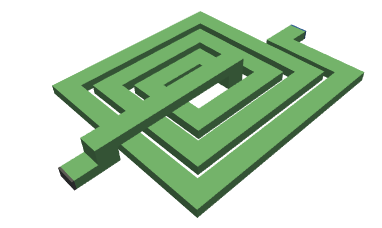

### examples_stl/inductor_core

* **3D inductor with a magnetic E-core**
* Defined with **STL files**

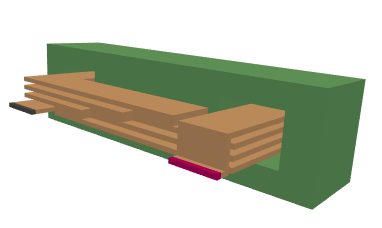

### examples_stl/transformer

* **Planar transformer with two windings**
* Defined with **STL files**

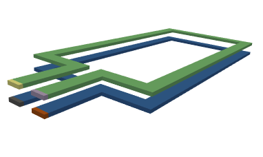

## Example Problems (Shape Mesher)

### examples_shape/busbar

* **Coplanar L-shaped busbar**
* Defined with **2D shapes**

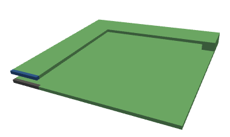

### examples_shape/coplanar

* **PCB with coplanar traces** (defined with 2D shapes)
* Defined with **2D shapes**

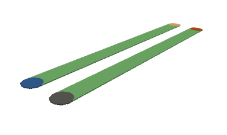

### examples_shape/trace

* **PCB with two traces**
* Defined with **2D shapes**

### examples_shape/wire

* **Straight round wire**
* Defined with **2D shapes**

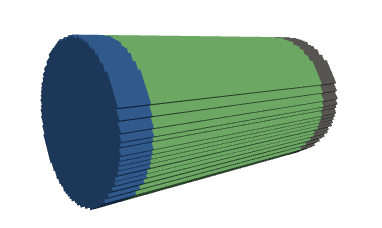

## Example Problems (PNG Mesher)

### examples_png/inductor_spiral

* **Planar spiral inductor**
* Defined with **PNG files**

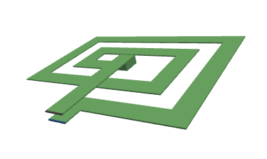

### examples_png/inductor_gap

* **Gapped inductor with a magnetic E-core**
* Defined with **PNG files**

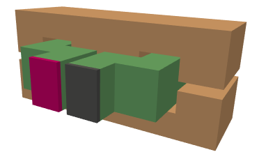

### examples_png/shield

* **Conductor loop with a magnetic shield**
* Defined with **PNG files**

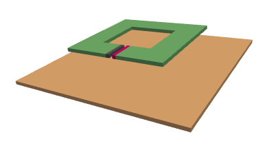

### examples_png/gerber

* **PCB inductor defined with GERBER files**
* The **PNG files** are generated from **GERBER files**

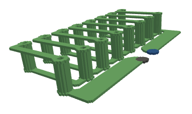

## Example Problems (Voxel Mesher)

### examples_voxel/slab

* **Simple slab conductor in free space**
* Defined with **voxel indices**

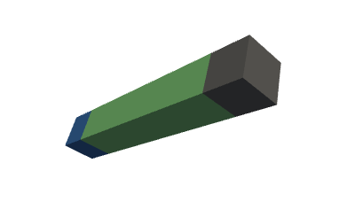

### examples_voxel/core

* **Simple slab conductor surrounded by a magnetic core**
* Defined with **voxel indices**

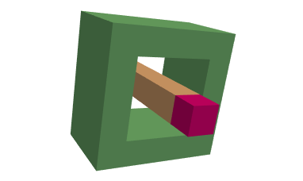

### examples_voxel/transformer

* **Simple transformer with a short-circuited winding**
* Defined with **voxel indices**

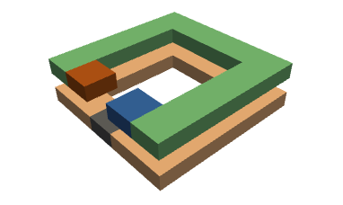

### examples_voxel/logo

* **Simple geometry used for the PyPEEC logo**
* Defined with **voxel indices**

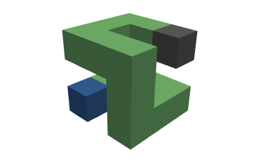
