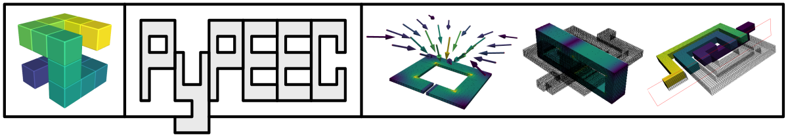

PyPEEC - 3D Quasi-Magnetostatic Solver
======================================

.. toctree::
   :caption: General Doc
   :maxdepth: 0
   :hidden:

   Home <self>
   content/about
   content/install
   content/tutorial
   content/examples
   content/gallery
   content/workflow

.. toctree::
   :caption: Technical Doc
   :maxdepth: 0
   :hidden:

   content/method
   content/technical
   content/formats
   content/warnings
   content/api

**PyPEEC** is a **3D quasi-magnetostatic PEEC solver** developed at **Dartmouth College** within the Power Management Integration Center (PMIC).
PyPEEC is a **fast solver** (FFT and GPU accelerated) that can simulate a large variety of **magnetic components** (inductors, transformers, chokes, IPT coils, busbars, etc.).
The tool contains a **mesher** (STL, PNG, and GERBER formats), a **solver** (static and frequency domain), and **advanced plotting** capabilities.
The code is written in **Python** and is fully **open source**!

------------

.. image:: images/badge_lang.svg
   :target: https://www.python.org/downloads
   :alt: python 3

.. image:: images/badge_license.svg
   :target: http://mozilla.org/MPL/2.0
   :alt: MPL-2.0

.. image:: images/badge_git.svg
   :target: https://github.com/otvam/pypeec
   :alt: git / repo

.. image:: images/badge_doc.svg
   :target: https://pypeec.otvam.ch
   :alt: doc / sphinx

.. image:: images/badge_pypi.svg
   :target: https://pypi.org/project/pypeec
   :alt: pypi / pkg

.. image:: images/badge_conda.svg
   :target: https://anaconda.org/conda-forge/pypeec
   :alt: conda / pkg

.. important::
    * **Website:** `pypeec.otvam.ch <https://pypeec.otvam.ch>`__
    * **Repository:** `github.com/otvam/pypeec <https://github.com/otvam/pypeec>`__
    * **Conda:** `anaconda.org/conda-forge/pypeec <https://anaconda.org/conda-forge/pypeec>`__
    * **PyPI:** `pypi.org/project/pypeec <https://pypi.org/project/pypeec>`__

------------

**PyPEEC** features the following **characteristics**:

* **PEEC method** with **FFT acceleration**
* **Fast** with **moderate memory** requirements
* Representation of the **geometry** with **3D voxels**
* **Parallel processing** and **GPU acceleration** are available
* Import the **geometry** from **STL**, **PNG**, and **GERBER** files
* Draw the **geometry** with stacked 2D **vector shapes** or **voxel indices**
* **Pure Python** and **open source** implementation
* Can be used from the **command line** pr with an **API**
* Advanced **plotting and visualization** capabilities
* Compatible with **Jupyter notebooks**
* Compatible with **ParaView**

**PyPEEC** solves the following **3D quasi-magnetostatic problems**:

* Frequency domain solution (DC and AC)
* Conductive and magnetic domains (ideal or lossy)
* Isotropic, anisotropic, lumped, and distributed materials
* Connection of current and voltage sources
* Extraction of the current density, flux density, and potential
* Extraction of the terminal voltage, current, and power
* Computation of the free-space magnetic near-field

**PyPEEC** has the following **limitations**:

* No capacitive effects
* No dielectric domains
* No force computations
* No advanced boundaries conditions
* No domain decomposition techniques
* No hierarchical matrix techniques
* No model order reduction techniques
* Limited to voxel geometries

The **PyPEEC** package contains the following **tools**:

* **mesher** - create a 3D voxel structure from STL or PNG files
* **viewer** - visualization of the 3D voxel structure
* **solver** - solver for the magnetic field problem
* **plotter** - visualization of the problem solution

------------

.. warning::
    The geometry is meshed with a **regular voxel structure** (uniform grid).
    Some geometries/problems are not suited for voxel structures (inefficient meshing).
    For such cases, PyPEEC can be very slow and consume a lot of memory.

.. note::
    * **Author:** `Thomas Guillod <https://otvam.ch>`__
    * **Institution:** `Dartmouth College <https://dartmouth.edu>`__
    * **Licence:** `MPL-2.0 <http://mozilla.org/MPL/2.0>`__

.. image:: images/institution.png
   :alt: Dartmouth and PMIC
