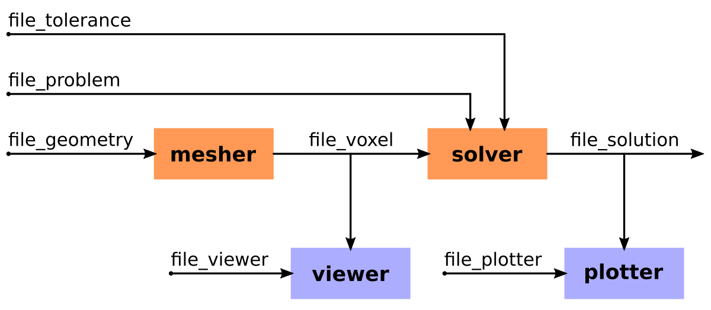

# PyPEEC - Getting Started

## Tools

The **PyPEEC** package contains the following tools::
* **mesher**
  * Create the voxel structure
  * Import the geometry from voxel files
  * Import the geometry from STL files
  * Create the geometry with stacked PNG files
  * Draw the geometry with stacked 2D vector shapes
  * Assign different domain names to the voxels
  * Resampling (refine) the voxel structure
  * Construct the graph of the structure and detect connected components
* **viewer**
  * Visualization of the different domains composing the voxel structure
  * Visualization of the connected components composing the voxel structure
  * Comparison of the voxelized and original geometries
* **solver**
  * Computation of the incidence matrix
  * Computation of the Green and coupling tensors
  * Computation of the resistance, inductance, and potential matrices
  * Computation of the electric-magnetic coupling matrices
  * Creation of the equation system
  * Extraction of a sparse pre-conditioner
  * Extraction of a matrix-vector linear operator for the full system
  * Check the condition number of the system
  * Solve the equation system with the pre-conditioner and the linear operator
  * Extract the solution (terminal voltages and currents, scalar fields, and vector fields)
* **plotter**
    * Plot the material description (materials and sources)
    * Plot the scalar and vector fields of the different voxels
    * Plot the magnetic field generated by the voxels
    * Plot the solver convergence and residuum

## Workflow

## Entry Points and Scripts

The entry points of the different tools are located in the `pypeec.main` module:
* running the tools with files as input/ouput
  * `run_mesher_file` for running the **mesher**
  * `run_viewer_file` for running the **viewer**
  * `run_solver_file` for running the **solver**
  * `run_plotter_file` for running the **plotter**
* running the tools with data as input/ouput
  * `run_mesher_data` for running the **mesher**
  * `run_viewer_data` for running the **viewer**
  * `run_solver_data` for running the **solver**
  * `run_plotter_data` for running the **plotter**

Additionally, a command line tool is located in the `pypeec.script` module:
* `pypeec --help` for displaying the command line options
* `pypeec mesher` for running the **mesher**
* `pypeec viewer` for running the **viewer**
* `pypeec solver` for running the **solver**
* `pypeec plotter` for running the **plotter**

## Input/Output File Description

The following input files (JSON or YAML format) are used:
* `file_geometry` (JSON or YAML, input file): description of the geometry
* `file_problem` (JSON or YAML, input file): description of the magnetic problem
* `file_tolerance` (JSON or YAML, input file): description of the solver numerical options
* `file_point` (JSON or YAML, input file): definition of a point cloud for evaluating the magnetic field
* `file_viewer` (JSON or YAML, input file): options for the plots generated by the viewer
* `file_plotter` (JSON or YAML, input file): options for the plots generated by the plotter

The following files (Pickle format) are generated:
* `file_voxel` (Pickle, output file): file with the definition of the voxel structure
* `file_solution` (Pickle, output file): file with the solution of the magnetic problem

## Definition of the Example Problems

Different examples are located in the `examples` folder:
* voxel structure generated from STL files (`examples_stl` folder)
  * **inductor_air**: a 3D air-core inductor
  * **inductor_core**: a 3D inductor with a magnetic E-core core
  * **transformer**: a planar transformer with two windings
* voxel structure generated from 2D vector shapes (`examples_shape` folder)
  * **busbar**: a coplanar L-shaped busbar
  * **wire**: a straight round wire
  * **trace**: a PCB with traces
  * **coplanar**: a set of coplanar traces
* voxel structure generated from PNG files (`examples_png` folder)
  * **inductor_spiral**: a planar spiral inductor
  * **inductor_spiral**: a gapped inductor with an E-core
  * **shield**: a conductor loop with a magnetic shield
  * **gerber**: a PCB inductor from GERBER files
* voxel structure created from voxel indices (`examples_voxel` folder)
  * **slab**: a simple slab conductor in free space
  * **core**: a simple slab conductor surrounded by a magnetic core
  * **transformer**: a simple coil with a secondary short-circuit winding
  * **logo**: a simple geometry used for the PyPEEC logo

## Running the Example Problems

The following files (located in the `examples` folder) are used to run the examples.
* for running the examples from a Jupyter notebook, use `notebook.ipynb` 
* for running the examples from Python
  * `examples_config.py` is used to select the example
  * `run_mesher.py` runs the mesher
  * `run_viewer.py` runs the viewer
  * `run_solver.py` runs the solver
  * `run_plotter.py` runs the plotter
* for running the examples from the Shell
  * `examples_config.sh` is used to select the example
  * `run_mesher.sh` runs the mesher
  * `run_viewer.sh` runs the viewer
  * `run_solver.sh` runs the solver
  * `run_plotter.sh` runs the plotter
