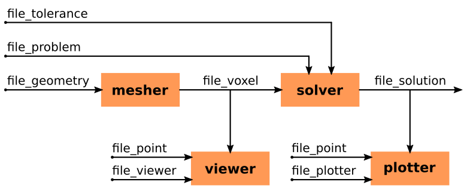

# PyPEEC - File Formats

## Workflow



## Geometry File Format

The `file_geometry` file format is used by the mesher.
This file contains the definition of the voxel structure.

```yaml
# mesher type
"mesh_type": "'voxel' or 'shape' or 'png'  or 'stl'"
    
# definition of the voxel structure
#   - specific for the different mesher types
#   - format definition is located in the next subsections
"data_voxelize": {}

# resampling of the voxel structure
#   - use_reduce: reduce (or not) the voxel structure by removing unused voxels
#   - use_resample: resample (or not) the voxel structure by subdividing voxels
#   - resampling_factor: array with resampling factors (x, y, and z directions)
"resampling":
    "use_reduce": true
    "use_resample": true
    "resampling_factor": [2, 2, 1]

# definition of the conflict resolution between domains
#   - during the voxelization, the same voxel can be assigned to several domains
#   - the shared voxels are located at the boundaries between domain
#   - the shared voxels are conflicts and should be assigned to a single domain
#   - list of dicts with the conflict resolution rules
#   - optional feature, the list can be empty if no conflict resolution is required
#   - conflict definition
#       - domain_resolve: list of domain names where the shared voxels should be removed
#       - domain_keep: list of domain names where the shared voxels should be kept
"domain_conflict":
    - {"domain_resolve": ["dom_cond"], "domain_keep": ["dom_src"]}
    - {"domain_resolve": ["dom_cond"], "domain_keep": ["dom_sink"]}

# pledge the existence or absence of connections between domains
#   - dict of dicts with the connection name and the connection definition
#   - optional feature, the dict can be empty without having an impact on the results
#   - connection definition
#       - connected: boolean specified if the two domain lists should be connected
#       - domain_group: list of list of domains where the connections are checks
#           - the outer list domains are used for the connection checks
#           - the inner list domains are merged together
"domain_connection":
    "connected": {"connected": true, "domain_group": [["dom_cond"], ["dom_src"], ["dom_sink"]]}
    "insulated": {"connected": false, "domain_group": [["dom_mag"], ["dom_src", "dom_cond", "dom_sink"]]}
```

### Definition from Index Arrays

```yaml
# voxel definition type ("voxel" for index arrays)
"mesh_type": "voxel"

# definition of the voxel structure
"data_voxelize": 
    # definition of the voxel structure
    #   - n: array with the number of voxels (x, y, and z directions)
    #   - d: array with the voxel dimensions (x, y, and z directions)
    #   - c: array with the coordinates of the voxel structure center (x, y, and z directions)
    "param":
        "n": [4, 4, 3]
        "d": [10.0e-3, 10.0e-3, 10.0e-3]
        "c": [0.0, 0.0, 0.0]
    
    # definition of the voxel indices of the different domains
    #   - dict of arrays with the domain name and the voxel indices
    #   - required information, the dict cannot be empty
    "domain_def":
        "dom_src": [1, 2]
        "dom_cond": [5, 6, 9, 10]
        "dom_sink": [13, 14]
        "dom_mag": [36, 37, 38, 39, 40, 41, 42, 43]
```

### Definition from 2D Vector Shapes

```yaml
# voxel definition type ("shape" for 2D vector shapes)
"mesh_type": "shape"

# definition of the voxel structure
"data_voxelize": 
    # definition of the voxel structure
    #   - dx: voxel dimension for the x direction
    #   - dy: voxel dimension for the y direction
    #   - dz: voxel dimension for the z direction
    #   - cz: coordinates of the voxel structure center for the z direction
    #   - tol: tolerance for simplifying the shapes
    #   - xy_min: array with the lower corner coordinates of the voxel structure (x and y directions)
    #   - xy_max: array with the upper corner coordinates of the voxel structure (x and y directions)
    #   - alternatively, the xy_min/xy_max can be set to null and the shape bounds are kept
    "param":
        "dx": 50.0e-6
        "dy": 50.0e-6
        "dz": 50.0e-6
        "cz": 0.0e-6
        "tol": 1.0e-6
        "xy_min": [-20e-3, -20e-3]
        "xy_max": [+20e-3, +20e-3]

    # definition of the layer stack (voxels in the z-direction)
    #   - list of dicts with the definition of the layers
    #   - required information, the list cannot be empty
    #   - layer definition
    #       - n_layer: number of voxels in the z-direction for the layer
    #       - tag_layer: string with the name of the layer
    "layer_stack":
        - { "n_layer": 1, "tag_layer": "mag"}
        - { "n_layer": 5, "tag_layer": "insulation_mag"}
        - { "n_layer": 1, "tag_layer": "cond"}
        - { "n_layer": 5, "tag_layer": "insulation_terminal"}
        - { "n_layer": 1, "tag_layer": "terminal"}
    
    # definition of the shapes composing the different domains
    #   - dict with the domain name and the shape definition
    #   - required information, the dict cannot be empty
    #   - domain definition
    #       - list of the different shapes composing the domain
    #       - layer_start: name of the layer where the shape starts
    #       - layer_stop: name of the layer where the shape stops
    #       - shape_add: list of shapes to be merged be added
    #       - shape_sub: list of shapes to be merged be subtracted
    #   - shape definition
    #       - shape_type: type of the shape ("pad" or "trace" or "polygon")
    #       - coord: array with the 2D coordinates composing the shape
    #       - buffer: thickness of the buffer around the polygons
    #       - diameter: diameter of the pads
    #       - width: thickness of the traces
    "geometry_shape":
        "dom_cond":
            -
                "layer_start": "cond"
                "layer_stop": "cond"
                "shape_add":
                    -
                        "shape_type": "trace"
                        "width": 0.5e-3
                        "coord": [[0.0e-3, 0.0e-3], [5.0e-3, 5.0e-3]]
                "shape_sub": []
        "dom_mag":
            -
                "layer_start": "mag"
                "layer_stop": "mag"
                "shape_add":
                    -
                        "shape_type": "polygon"
                        "buffer": 0.0
                        "coord": [[0.0e-3, 0.0e-3], [5.0e-3, 0.0e-3], [5.0e-3, 5.0e-3], [0.0e-3, 5.0e-3]]
                "shape_sub":
                    -
                        "shape_type": "polygon"
                        "buffer": 0.0
                        "coord": [[1.0e-3, 1.0e-3], [3.0e-3, 1.0e-3], [3.0e-3, 3.0e-3], [1.0e-3, 3.0e-3]]
        "dom_src":
            -
                "layer_start": "insulation_terminal"
                "layer_stop": "terminal"
                "shape_add":
                    -
                        "shape_type": "pad"
                        "diameter": 0.7e-3
                        "coord": [[0.0e-3, 0.0e-3]]
                "shape_sub": []
        "dom_sink":
            -
                "layer_start": "insulation_terminal"
                "layer_stop": "terminal"
                "shape_add":
                    -
                        "shape_type": "pad"
                        "diameter": 0.7e-3
                        "coord": [[5.0e-3, 5.0e-3]]
                "shape_sub": []    
```

### Definition from PNG Files

```yaml
# voxel definition type ("png" for PNG files)
"mesh_type": "png"

# definition of the voxel structure
"data_voxelize":
    # definition of the voxel structure
    #   - d: array with the voxel dimensions (x, y, and z directions)
    #   - c: array with the coordinates of the voxel structure center (x, y, and z directions)
    #   - size: array with the size of the images (number of voxels in the x and y direction)
    "param":
        "d": [10.0e-3, 10.0e-3, 10.0e-3]
        "c": [0.0, 0.0, 0.0]
        "size": [49, 49]
        
    # definition of the mapping between the image color and the different domains
    #   - dict with the domain name and the specified colors
    #   - required information, the dict cannot be empty
    #   - the colors are specified with an array of colors (RGBA format)
    "domain_color":
        "dom_src": [[255, 0, 0, 255]]
        "dom_cond": [[0, 0, 0, 255]]
        "dom_sink": [[0, 255, 0, 255]]
        "dom_mag": [[0, 0, 255, 255]]
    
    # definition of the layer stack (voxels in the z-direction)
    #   - list of dicts with the definition of the layers
    #   - required information, the list cannot be empty
    #   - layer definition
    #       - n_layer: number of voxels in the z-direction for the layer
    #       - filename_list: list of strings with the PNG files defining the layer
    "layer_stack":
        - {"n_layer": 1, "filename_list": ["png/layer_bottom.png"]}
        - {"n_layer": 8, "filename_list": ["png/layer_mid.png"]}
        - {"n_layer": 1, "filename_list": ["png/layer_top.png"]}
```

### Definition from STL Files

```yaml
# voxel definition type ("stl" for STL files)
"mesh_type": "stl"

# definition of the voxel structure
"data_voxelize":
    # definition of the voxel structure
    #   - d: array with the voxel dimensions (x, y, and z directions)
    #   - xyz_min: array with the lower corner coordinates of the voxel structure (x, y, and z directions)
    #   - xyz_max: array with the upper corner coordinates of the voxel structure (x, y, and z directions)
    #   - alternatively, the xyz_min/xyz_max can be set to null and the STL mesh bounds are kept
    "param":
        "d": [10.0e-3, 10.0e-3, 10.0e-3]
        "xyz_min": [-20e-3, -20e-3, -20e-3]
        "xyz_max": [+20e-3, +20e-3, +20e-3]
        
    # definition of the STL files of the different domains
    #   - dict with the domain name and the STL files
    #   - required information, the dict cannot be empty
    #   - domain definition
    #       - list of STL meshes composing the domain
    #       - offset: array with offsets for translating the STL meshes
    #       - filename: string with the STL filename
    "domain_stl":
        "dom_src": [{"offset": [0.0, 0.0, 0.0], "filename": "stl/dom_src.stl"}]
        "dom_cond": [{"offset": [0.0, 0.0, 0.0], "filename": "stl/dom_cond.stl"}]
        "dom_sink": [{"offset": [0.0, 0.0, 0.0], "filename": "stl/dom_sink.stl"}]
        "dom_mag": [{"offset": [0.0, 0.0, 0.0], "filename": "stl/dom_mag.stl"}]
```

## Problem File Format

The `file_problem` file format is used by the solver.
This file contains the definition of the magnetic problem to be solved.

```yaml
# material definition
#   - dict of dicts with the material name and the material definition
#   - required information, the dict cannot be empty
#   - electric and magnetic materials can be defined
#   - material definition
#       - domain_list: list of domains with the specified material
#       - material_type: material type ("electric" or "magnetic")
#       - var_type: type of material parameters ("lumped" or "distributed")
#           - var_type" is equal to "lumped", the material parameters are homogeneous 
#           - var_type" is equal to "distributed", the material parameters are space-dependent 
"material_def":
    "mat_electric": {"domain_list": ["dom_src", "dom_cond", "dom_sink"], "material_type": "electric", "var_type": "lumped"}
    "mat_magnetic": {"domain_list": ["dom_mag"], "material_type": "magnetic", "var_type": "lumped"}

# source definition
#   - dict of dicts with the source name and the source definition
#   - required information, the dict cannot be empty
#   - sources can only be defined on electric material domains
#   - source definition
#       - domain_list: list of domains with the specified source
#       - source_type: source type ("current" or "voltage")
#       - var_type: type of source parameters ("lumped" or "distributed")
#           - var_type" is equal to "lumped", the source parameters are homogeneous 
#           - var_type" is equal to "distributed", the source parameters are space-dependent 
"source_def":
    "src": {"domain_list": ["dom_src"], "source_type": "current", "var_type": "lumped"}
    "sink": {"domain_list": ["dom_sink"], "source_type": "voltage", "var_type": "lumped"}

# definition of the sweep configurations to be run
#   - dict with the sweep names and the sweep dependencies
#   - required information, the dict cannot be empty
#   - the dict keys represent the name of the sweeps
#   - the dict values represent the name of the dependencies
#       - the dependency is used as an initial guess for the solver
#       - if null, no initial guess is used for the solver
"sweep_config":
    "sim_dc": null
    "sim_ac": "sim_dc"

# material parameters and source values definition
#   - dict of dicts with the material parameters and source values definition
#   - required information, the dict cannot be empty
#   - each dict represents a specific sweep configuration
#   - material parameters and source values definition
#       - freq: operating frequency for the problem (DC or AC)
#       - material_val: material parameters
#           - dict of dicts with the material name and the material definition
#           - electric material definition
#               - rho_re: material real resistivity (should be positive)
#               - rho_img: material imaginary resistivity (should be positive)
#           - magnetic material definition
#               - chi_re: material real susceptibility (should be positive)
#               - chi_im: material imaginary susceptibility (should be positive)
#           - material parameters
#               - scalar if "var_type" is equal to "lumped"
#               - array if "var_type" is equal to "distributed"
#       - source_val: source parameters
#           - dict of dicts with the source name and the source definition
#           - current source definition
#               - I_re: current source value (real part)
#               - I_im: current source value (imaginary part)
#               - Y_re: current internal admittance (real part)
#               - Y_im: current internal admittance (imaginary part)
#           - voltage source definition
#               - V_re: voltage source value (real part)
#               - V_im: voltage source value (imaginary part)
#               - Z_re: voltage internal impedance (real part)
#               - Z_im: voltage internal impedance (imaginary part)
#           - source values
#               - scalar if "var_type" is equal to "lumped"
#               - array if "var_type" is equal to "distributed"
"sweep_param":
    "sim_dc":
        "freq": 0.0
        "material_val":
            "mat_electric": {"rho_re": 1.0e-8, "rho_im": 0.0"}
            "mat_magnetic": {"chi_re": 100.0, "chi_im": 10.0}
        "source_val":
            "src": {"I_re": 1.0, "I_im": 0.0, "Y_re": 0.5, "Y_im": 0.0}
            "sink": {"V_re": 0.0, "V_im": 0.0, "Z_re": 2.0, "Z_im": 0.0}
    "sim_ac":
        "freq": 1.0e+3
        "material_val":
            "mat_electric": {"rho_re": 1.0e-8, "rho_im": 0.0"}
            "mat_magnetic": {"chi_re": 100.0, "chi_im": 10.0}
        "source_val":
            "src": {"I_re": 1.0, "I_im": 0.0, "Y_re": 0.5, "Y_im": 0.0}
            "sink": {"V_re": 0.0, "V_im": 0.0, "Z_re": 2.0, "Z_im": 0.0}
```

## Point File Format

The `file_point` file format is used by the viewer and plotter.
This file contains the definition of the points used for magnetic field evaluation.

```yaml
# 2D array containing the points used for magnetic field evaluation
#   - the number of points (n_pts) can be zero.
#   - the array has the following size: (n_pts, 3)
#   - the points should be located outside the active voxels
[
    [-1.0, +1.0, +1.0],
    [+1.0, -1.0, +1.0],
    [+1.0, +1.0, -1.0],
]
```

## Other File Formats

* The configuration file format is documented in `pypeec/config.yaml`.
* The `file_tolerance` format is documented in `examples/config/tolerance.yaml`.
* The `file_viewer` format is documented in `examples/config/viewer.yaml`.
* The `file_plotter` format is documented in `examples/config/plotter.yaml`.
